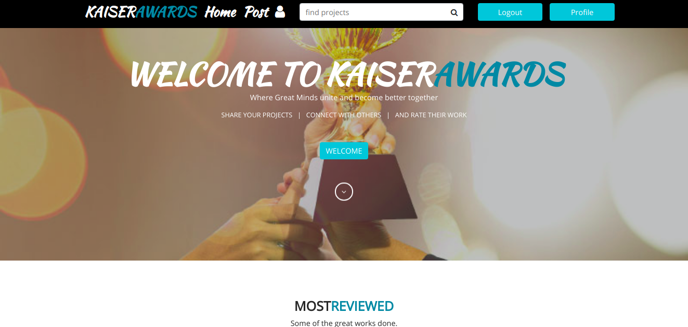

# THE AWWWARDS(kaiserawards)

## DESCRIPTION

 This is an application where users have the ability to rate other projects posted by different individuals and get their rating from their work

  

## Generated by John Karanja N

### View Live Site here 

        Enjoy the application.
        

## User Stories
* Sign in to the application to start using.
* Upload my projects to the site.
* See my profile with all my pictures.
* Rate other users and see their projects.

## BDD Specifications

| Behaviour      |          Input           |                                 Output                                  |
| :------------- | :----------------------: | :---------------------------------------------------------------------: |
| accounts page loads | registration form with accounts specifications |                        On sumbit should redirect to homepage                        |
| Search form | search for users by username.|              projects from username are brought up           |
| on index page  | navigate with buttons on the navigation bar to use your account  | section for editing profile and and also posting new projects. |
           

## Technologies used

        Python 3.6
        Django ==1.11.5
        Postgresql
        HTML
        CSS
        Bootstrap
        Javascript

## copyright

      ©2019 [John Karanja N.]

## Support and contact details

      tel:+254717067537 E_mail : kaiserjohn52@gmail.com

## Bugs

      None Detected

## Acknowledge

      It will be a great pleasure for anyone who wishes to use the Instagram clone application.